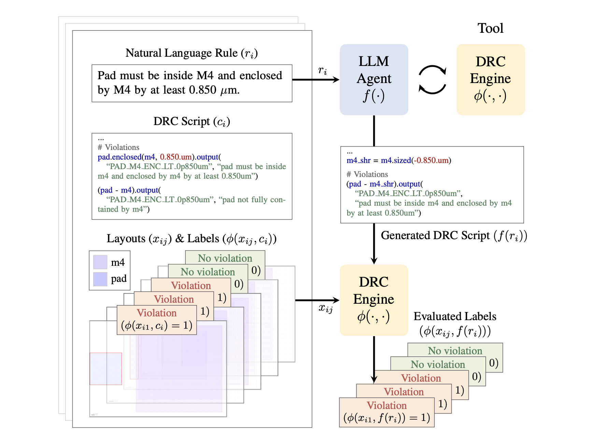

<h1 align="center">Rule2DRC</h1>

<p align="center">
  
</p>


<p align="center">
  <b>A LLM benchmark for generating Design Rule Checking (DRC) scripts from natural-language design-rule specifications.</b>
</p>

<p align="center">
  <a href="https://arxiv.org/abs/2605.15669"></a>
  <a href="https://huggingface.co/papers/2605.15669"></a>
  <a href="https://huggingface.co/datasets/jusjinuk/Rule2DRC"></a>
  <a href="./LICENSE"></a>
</p>

## Overview

Manufacturable chips should satisfy thousands of geometry-based design rules. **Design Rule Checking (DRC)** enforces these rules by running executable scripts written in domain-specific languages on layouts and checking constraints such as widths, spacings, enclosures, and overlaps. Writing DRC scripts from natural-language specifications is labor-intensive and requires specialized EDA expertise.

**Rule2DRC** evaluates whether an LLM agent can synthesize runnable KLayout DRC Ruby scripts from these specifications. Each problem contains a natural-language rule, layer definitions, the gold DRC script, and labeled GDS testcases. A generation is evaluated as successful only if the generated script compiles and matches all testcase labels for the problem. The benchmark contains **1,000 problems** and **13,921 labeled GDS testcases**.

## News

- **Aug 2026**: We will present Rule2DRC at [Agentic AI Summit 2026 @ UC Berkeley](https://rdi.berkeley.edu/events/agentic-ai-summit-2026).
- **May 2026**: Rule2DRC is released and accepted to ICML 2026.

## Dataset

The dataset is hosted on Hugging Face:

```python
from datasets import load_dataset

tasks = load_dataset("jusjinuk/Rule2DRC", "tasks", split="test")
testcases = load_dataset("jusjinuk/Rule2DRC", "testcases", split="test")
```

The `tasks` config has one row per benchmark problem, including `problem_id`, `prompt`, `spec_yaml`, `gold_drc`, and metadata. The `testcases` config has one row per GDS testcase, including `problem_id`, `gds_path`, `label`, `labels_json`, and binary `gds` bytes.

First materialize the Hugging Face dataset into the directory layout expected by the evaluation scripts:

```bash
python scripts/materialize_hf_dataset.py
```

This creates:

```text
problems/{problem_id}/spec.yaml
problems/{problem_id}/gold/{problem_id}.drc
problems/{problem_id}/data/gds/labels.csv
problems/{problem_id}/data/gds/{pass,fail}/*.gds
```

## Installation

Install Python dependencies:

```bash
uv sync
source .venv/bin/activate
```

KLayout is required for DRC execution. See [KLAYOUT.md](./KLAYOUT.md) for installation instructions, then make sure `klayout` is on `PATH`:

```bash
klayout -v
```

## Quick Start

Render a prompt:

```bash
python evaluate/make_prompt.py problems 0001
```

Evaluate the gold decks:

```bash
python eval.py --dir problems --jobs 100
```

Evaluate a single problem:

```bash
python eval.py --dir problems --problem 0001 --jobs 1
```

Outputs are written under `out_eval/`.

## Generating and Evaluating Model Outputs

The generation scripts use an OpenAI-compatible API. By default, the wrappers point to local vLLM at `http://127.0.0.1:8000/v1`.

### Start vLLM

Start an OpenAI-compatible server, for example:

```bash
export OPENAI_API_KEY=dummy
bash scripts/vllm/run_vllm.sh openai/gpt-oss-120b 8000
```

Most wrappers can be configured with environment variables such as `MODEL`, `BASE_URL`, `API_KEY`, `PROBLEMS_DIR`, `JOBS`, and `REASONING_EFFORT`.

### Generate Best-of-N (BoN) Candidates and Initial GDS Tests

Generate the maximum BoN candidate pool once:

```bash
bash scripts/run_bon.sh 60
```

This writes a Bon60 run under `out_drc/problems/{bon60_run}/`. Reuse this same directory for Bon10 x 3, Bon15 x 3, and Bon20 x 3 by partitioning the candidates into pools.

Generate self-generated GDS tests for candidate selection:

```bash
bash scripts/run_gen_tests.sh 8
```

This writes a test-generation run under `out_gds/problems/{gds_run}/`.

### Score Generated Tests

Bon60 is only the shared candidate source. Reported settings partition it into smaller pools:

| Setting | `<cand_min>` | `<cand_max>` | `<pool_size>` |
|:---|---:|---:|---:|
| Bon10 x 3 runs | 0 | 30 | 10 |
| Bon15 x 3 runs | 0 | 45 | 15 |
| Bon20 x 3 runs | 0 | 60 | 20 |

First score the generated GDS tests on the chosen partition. Scoring wrappers take `<cand_min> <cand_max> <pool_size>`:

```bash
# Generated Tests baseline
bash scripts/score_generated_tests.sh out_drc/problems/{bon60_run} out_gds/problems/{gds_run} <cand_min> <cand_max> <pool_size>
```

### Run Tester Agents

Run tester agents after `score_generated_tests.sh`, since they reuse generated-test scores and artifacts. `score_ours.sh` runs **SplitTester (Ours)**; the other scripts run comparison baselines.

```bash
# SplitTester (Ours)
bash scripts/score_ours.sh out_drc/problems/{bon60_run} out_gds/problems/{gds_run} <cand_min> <cand_max> <pool_size>

# S* baseline
bash scripts/score_s_star.sh out_drc/problems/{bon60_run} out_gds/problems/{gds_run} <cand_min> <cand_max> <pool_size>

# CodeMonkey-style baseline
bash scripts/score_codemonkey_select.sh out_drc/problems/{bon60_run} out_gds/problems/{gds_run} <cand_min> <cand_max> <pool_size>

# LLM judge baseline
bash scripts/score_llm_judge.sh out_drc/problems/{bon60_run} <cand_min> <cand_max> <pool_size>
```

### Aggregate Scores

Aggregate with the corresponding method key. Aggregation also takes `<cand_min> <cand_max> <pool_size>`:

```bash
bash scripts/aggregate_bon_scores.sh out_drc/problems/{bon60_run} <method_key> <cand_min> <cand_max> <pool_size> out_gds/problems/{gds_run}
```

Method keys:

- `generated_tests`: select by self-generated GDS tests.
- `generated_tests_ours`: select with **SplitTester (Ours)**.
- `generated_tests_s_star`: select with the S* baseline.
- `generated_tests_codemonkey_select`: select with the CodeMonkey-style baseline.
- `llm_judge`: select with an LLM judge over generated DRC code.

Aggregated JSON files are saved under the BoN run directory as `bon_pool<pool_size>__<method_key>.json`, for example `out_drc/problems/{bon60_run}/bon_pool10__generated_tests_ours.json`.

## TODO

- [ ] Build a public leaderboard website.
- [ ] Add private held-out tasks.
- [ ] Evaluate additional models and upload their results.

## Citation

```bibtex
@InProceedings{kim2026rule2drc,
  title     = {{Rule2DRC: Benchmarking LLM Agents for DRC Script Synthesis with Execution-Guided Test Generation}},
  author    = {Kim, Jinuk and Byun, Junsoo and Hwang, Donghwi and Park, Seong-Jin and Song, Hyun Oh},
  booktitle = {Proceedings of the 43rd International Conference on Machine Learning},
  year      = {2026},
  volume    = {306},
  series    = {Proceedings of Machine Learning Research},
  publisher = {PMLR}
}
```

## License

MIT
